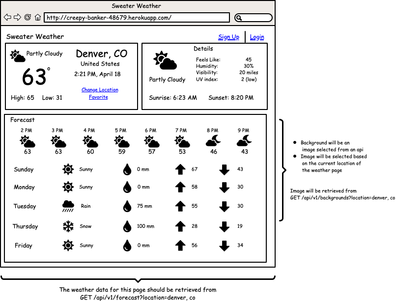
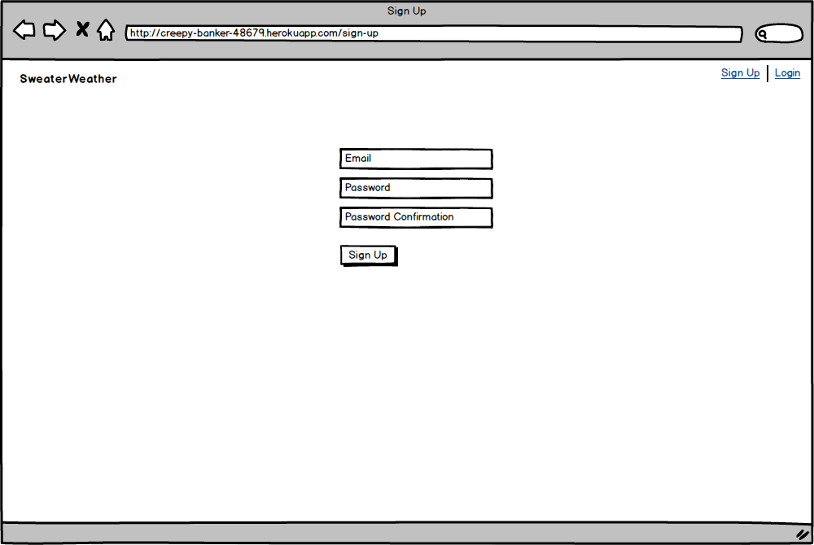
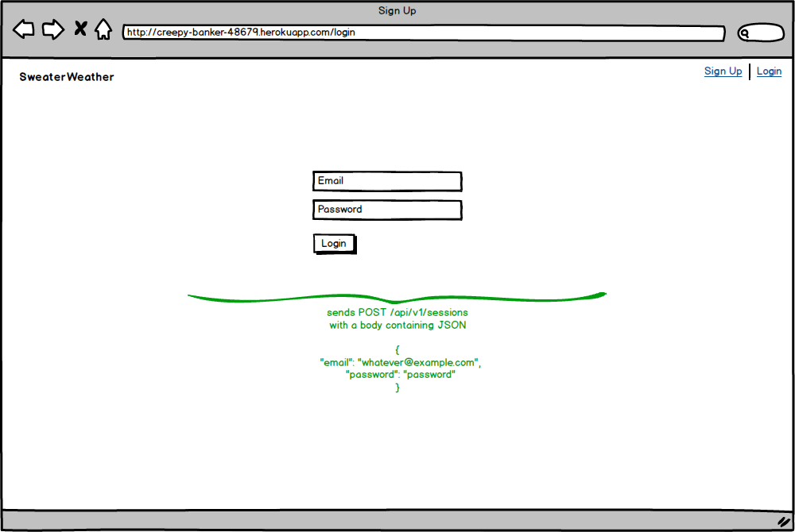

## Sweater Weather API

The sweater weather API is a 3-day solo project that provides the front end of the Sweater Weather App, the data it needs for its views. It consumes the [Google Map Geocoding](https://developers.google.com/maps/documentation), [OpenWeather](https://openweathermap.org/api/one-call-api) and [Unsplash](https://unsplash.com/documentation) APIs to return JSON API 1.0 compliant data to the front end. The Sweater Weather API is hosted [here](https://thesweaterweather.herokuapp.com/) but you can also get a local copy and run it locally by following the instructions of the getting started section.

## Table of Contents

* [About the Project](#about-the-project)
  * [Areas of Focus](#demo)
  * [Built With](#built-with)
  * [Schema](#schema)
* [Getting Started](#getting-started)
  * [Installation](#installation)
  * [Testing](#testing)
* [Sweater Weather Access Points](#access-point)
* [Acknowledgements](#acknowledgements)

## About The Project

Sweater Weather is a Ruby on Rails API built to meet the following user stories/requirements.






### Areas of Focus: 

- refactoring
- serializers
- consuming APIs
- exposing APIs
- authentication
- password encryption

### Built with:

- Ruby: 2.4.1
- PostgreSQL: 12.2
- Rails: 5.2.4
- Continuous Integration: Travis CI
- Bcrypt (password encryption)


## Getting Started

To get a local copy up and running follow these simple steps.

### Installation

1. Clone the repo
```sh
git clone git@github.com:adumortier/sweater_weather.git
```
2. Install the Gem File
```sh
bundle install
```
3. Create your environment
```sh
rails db:create
rails db:migrate
```
4. Install Figaro
```sh
bundle exec figaro install
```
5. Visit the Google API, OpenWeather and Unsplash site to retrieve your API keys. The keys must be stored securely in the `application.yml` file of your `app/config` directory.

```sh
GOOGLE_API_KEY: <YOUR GOOGLE API KEY HERE>
OPEN_WEATHER_API_KEY: <YOUR OPEN WEATHER API KEY HERE>

UNSPLASH_ACCESS_KEY: <YOUR UNSPLASH ACCESS KEY HERE>
UNSPLASH_SECRET_KEY: <YOUR UNSPLASH SECRET KEY HERE>

AMYPODE_API_KEY: <YOUR AMYPODE API KEY HERE>
```
6. Add your keys to your app on Heroku 

```sh
figaro heroku:set -e production
```

### Testing

## Sweater Weather Access Points 

Retrieve a background picture for a specific location:
```sh
GET api/v1/backgrounds?location=<location_name_here>
```
Expected response: 
```sh
{
    "data": {
        "id": "poro",
        "type": "background",
        "attributes": {
            "url": "image_link_here"
        }
    }
}
```
Retrieve weather forecast for a specific location:
```sh
GET api/v1/forecast?location=<location_name_here>
```
Expected response: 
```sh
"data": {
        "id": "poro",
        "type": "weather_info",
        "attributes": {
            "weather_today_general": {
                "location": "Paris",
                "time": "6:26 PM, April 21",
                "current_temperature": 66,
                "description": "scattered clouds",
                "temperature_high": 58,
                "temperature_low": 66,
                "icon": "http://openweathermap.org/img/wn/03d@2x.png"
            },
            "weather_today_details": {
                "feels_like": 60,
                "humidity_percent": 45,
                "visibility_miles": 6,
                "description": "scattered clouds",
                "icon": "http://openweathermap.org/img/wn/03d@2x.png",
                "sunrise_time": "4:47 AM",
                "sunset_time": "6:50 PM",
                "uv_index": 5
            },
            "weather_forecast": {
                "forecast_hourly": [
                    {
                        "time": "6 PM",
                        "temperature": 66,
                        "icon": "http://openweathermap.org/img/wn/03d@2x.png"
                    },
                    {
                        "time": "7 PM",
                        "temperature": 64,
                        "icon": "http://openweathermap.org/img/wn/02n@2x.png"
                    },
                    ...
                    ]
              "forecast_daily": [
                    {
                        "day": "Tuesday",
                        "description": "Clouds",
                        "precipitation_mm": 0,
                        "high_temp": 66,
                        "low_temp": 58,
                        "icon": "http://openweathermap.org/img/wn/03d@2x.png"
                    },
                    {
                        "day": "Wednesday",
                        "description": "Clear",
                        "precipitation_mm": 0,
                        "high_temp": 68,
                        "low_temp": 52,
                        "icon": "http://openweathermap.org/img/wn/01d@2x.png"
                    },
                    ...
                    ]      
              }
        }
    }
}

```
Register a new user:
```sh
POST api/v1/users?email=<email_address_here>&password=<password_here>&password_confirmation=<confirmation_password_here>
```
Expected response: 
```sh
{
    "data": {
        "id": "3",
        "type": "users",
        "attributes": {
            "email": "email_address_here",
            "api_key": "api_key_here"
        }
    }
}
```
Login a registered user:
```
POST api/v1/sessions?email=<email_address_here>&password=<password_here>
```
Expected response: 
```sh
{
    "data": {
        "id": "3",
        "type": "users",
        "attributes": {
            "email": "email_address_here",
            "api_key": "api_key_here"
        }
    }
}
```

Returns road trip information for a registered user:
```
POST api/v1/road_trip?origin=<origin_here>&destination=<destination_here>&api_key=<api_key_here>
```
Expected response: 
```sh
{
    "data": {
        "id": "poro",
        "type": "road_trip",
        "attributes": {
            "origin": "origin here",
            "destination": "destination here",
            "travel_time_in_sec": travel_time_in_sec as integer,
            "arrival_temp": temperature in Fahrenheit as integer,
            "arrival_weather": "weather summary at destination"
        }
    }
}
```
[need to add ruby version, api docs, areas of focus for the project]
